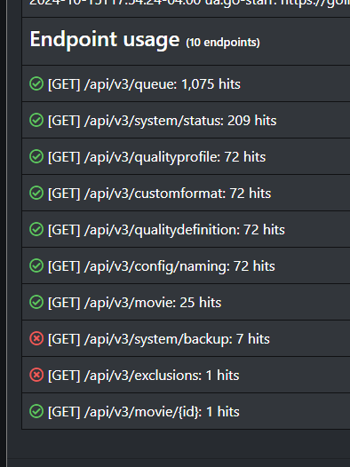
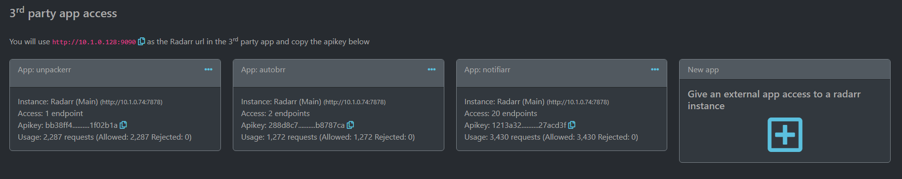

# Starr Proxy

## Note!

This is still very much in development (mainly the templates) and being tested. There will be force pushes until the "base" code is stable and then a normal commit process will start.

## Purpose

Provide access scoped apikeys & stop letting every 3rd party app and script have full access to your starr instance(s)!

Some apps only need one or two endpoints but have full access/control over everything, needlessly.

Access logs per app are generated so you can see everytime the app hits the proxy, allowed and rejected requests, etc

## App templates

There are some pre-built templates than enable just the api access the app actually needs so they are quick and easy to setup. More will be added in time for the common 3rd party apps.

## Automation

When the app is first opened, it checks for a `key` file in `/config` and if it is not present, it creates it with a 32 char apikey. Since automation will not open the UI this file will need to be created automatically as well. Create `/config/key` and add a 32 character key to it.

All internal api requests will authenticate with either:

```
Header: "X-Api-Key: <starrproxy-apikey>"
Parameter: "?apikey=<starrproxy-apikey>"
```

If you need to auto add starr apps and 3rd party apps you can do that via the api endpoint `/api/addstarr`. Send a curl `post` request to the starr proxy url with the json header and the payload below

``` json
{
    "name": "notifiarr",
    "starr": "radarr",
    "url": "http://<starr-ip>:<starr-port>",
    "apikey": "<starr-apikey>",
    "template": "notifiarr"
}
```

The `template` variable is not required but if you do not use an existing template then the app will have no starr api access initially.

An example curl would be:

``` bash
curl -i -H "Content-Type:application/json" -d "{\"name\":\"notifiarr\",\"starr\":\"radarr\",\"url\":\"http://<starr-ip>:<starr-port>\",\"apikey\":\"<starr-apikey>\",\"template\":\"notifiarr\"}" "http://10.1.0.128:9090/api/addstarr?apikey=<starrproxy-apikey>"
```

Responses will be `json`

Success:

``` json
{
    "proxied-scope": "notifiarr's template access (25 endpoints)",
    "proxied-url": "http://10.1.0.128:9090",
    "proxied-key": "c54696c9a238336712454dc7aa088190"
}
```

Errors:

``` json
{
    "error": "Starr Proxy: no apikey provided"
    "error": "Starr Proxy: provided apikey is not valid for internal api access"
    "error": "Starr Proxy: missing required fields for addstarr endpoint. Optional: template | Required: name, starr, url, apikey"
    "error": "Starr Proxy: invalid internal api route"
    "error": "Starr Proxy: provided apikey is not valid or has no access"
    "error": "Starr Proxy: name field is required, should be the name of the 3rd party app/script"
    "error": "Starr Proxy: url field is required, should be the local url to the starr app"
    "error": "Starr Proxy: apikey field is required, should be the apikey to the starr app"
    "error": "Starr Proxy: starr field is required, should be one of: lidarr, radarr, readarr, sonarr, whisparr"
    "error": "Starr Proxy: starr field is not valid, should be one of: lidarr, radarr, readarr, sonarr, whisparr"
    "error": "Starr Proxy: could not connect to the starr app (radarr)"
    "error": "Starr Proxy: requested template (fake-template) does not exist for radarr, provide a valid template or leave it blank"
}
```

## Compose example

``` yaml
services:
  starrproxy:
    container_name: starrproxy
    image: ghcr.io/notifiarr/starrproxy:main
    restart: unless-stopped
    ports:
      - 9090:80/tcp
    environment:
      - TZ=America/New_York
    volumes:
      - /volume1/data/docker/starrproxy/config:/config

```

## Run example

``` bash
docker run \
  -d \
  --name "/starrproxy" \
  --hostname "/starrproxy" \
  --volume "/volume1/data/docker/starrproxy/config:/config:rw" \
  --restart "unless-stopped" \
  --publish "9090:80/tcp" \
  --network "bridge" \
  --env "TZ=America/New_York" \
  "ghcr.io/notifiarr/starrproxy:main"
```

## Environment

### Volumes

Name: `App config`, Host: `/volume1/data/docker/starrproxy/config`, Container: `/config`

### Ports

Inside: `80`, Outside: `9999`

### Variables

Name: `TZ`, Key: `TZ`, Value: `America/New_York`

## Screenshots

When viewing the access log for an allowed app, endpoints tab contains all the endpoints referenced in the log and if the app has access or not. Clicking the red x allows access.



Easily view apps, what they access, etc


